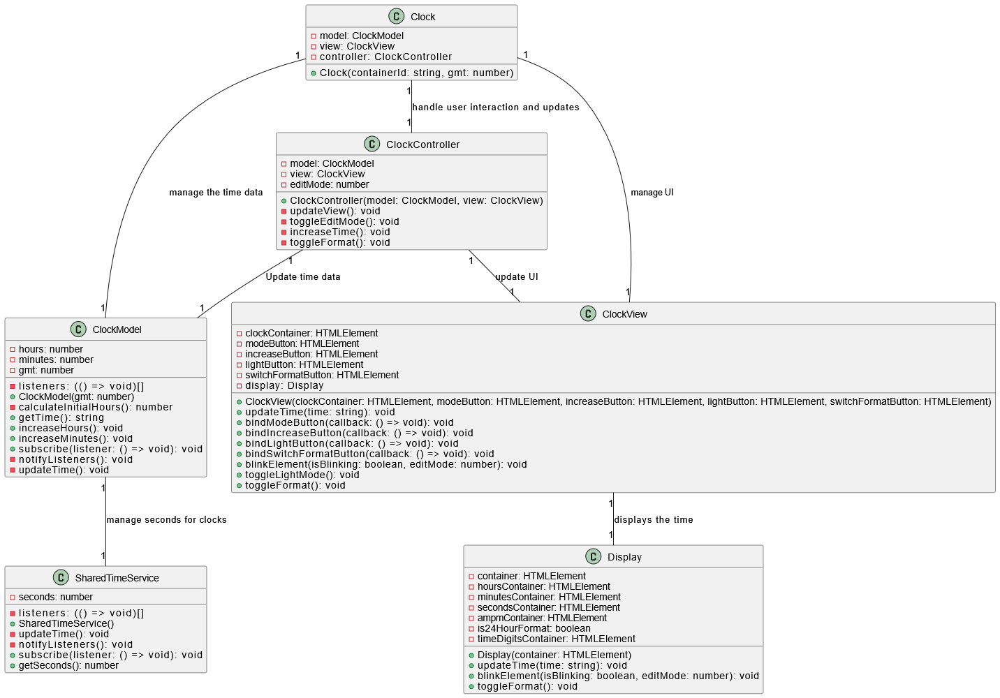

# GE  Healthcare Test

## Context

This project is a technical test including the creation of a clock using only vanilla features and using MVC integration. The goal is to make a clock that display time, can increment minutes and hours using mode and increment buttons. Here is all functionnalities :

### Part A

#### Functionalities

- Display a clock that shows the current time.
- A mode button that switches between 3 modes (unused, hours, minutes)
- A light mode button that switches between white and yellow background colors
- An increment button that increment hours or minutes or do nothing depending on mode button and manage threshold (60 minutes and 24 hours)

#### Display

- Time display even when being modified
- Hours or minutes blink when the mode button is used

### Part B

#### Functionalities

- GMT time management on Clock creation
- Switch button to switch format AM/PM - 24 hours [TODO]
- Manage AM/PM and 24 hours format management [TODO]
- Delete button for a clock [TODO]
- Button to add a clock with GMT time management [TODO]

## Class diagram



## Using the project

```javascript
npm install
npm run start
```

## Current improvements

- Do part B (Will be done by the time as I'm currently doing It)